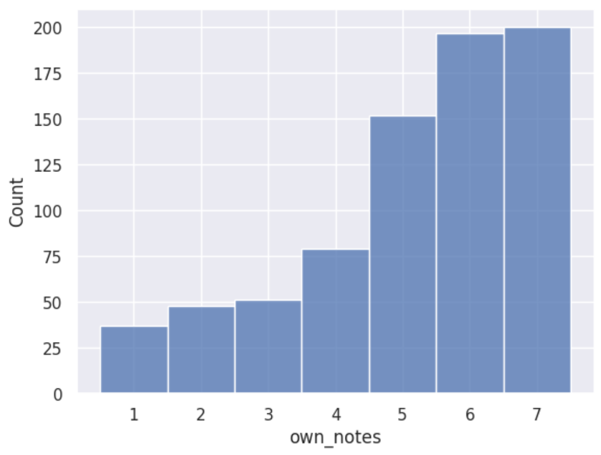
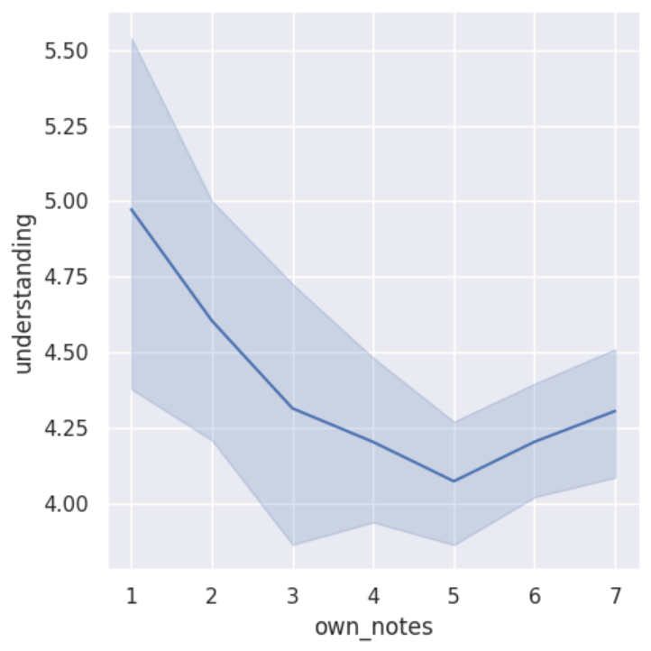
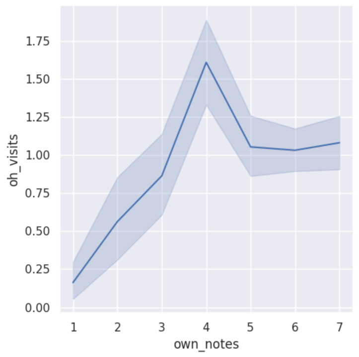

---
# Do not edit the text between these lines!
layout: default
---

# COMP110 Data Analysis of Note-Taking vs. Student Performance

<!-- This is a comment. Below, you'll see code for inserting an image. To make this image appear, update <custom-path>. To add an image, save it inside the imgs folder of this repository. -->

## Analysis

My COMP110 improvement idea:

**The course should add an extra credit assignment at the end of the year where students turn in**
**their handwritten notes because it would encourage active listening in class and reduce TA workload.**

This idea could potentially both increase in-class engagement for students and reduce TA work (assisting confused, unengaged students).

After importing all relevant functions from data_utils.py, I converted all the raw data I needed for my data analysis into a select few useable columns. Then, I wrangled my data further into ints so seaborn could use it to produce graphs, and I used my dataset to gather simple info for Figure 1, my histogram.

## Figure 1

Figure 1: This histogram shows how often students already take notes in class.

**Histogram Descriptive Statistics:**

*Mean: 5.16*

*Median: 6*

*Mode: 7*

## Figure 2

Figure 2: This graph compares note-taking habits with students' reported understanding of the material as a whole.

## Figure 3

Figure 3: This graph compares note-taking habits with office hour visits.

## Conclusion

The above analysis was created to determine whether or not offering extra credit for handwritten notes would improve student understanding and engagement and reduce reliance on office hours and TA help. Based on the data, the results are inconclusive and do not clearly support the original idea.

The histogram of own_notes shows that many students already report significant levels of note-taking, suggesting that note-taking is already a common habit in the course. This indicates that an extra credit incentive may not have as much of an impact as previously theorized, since a more students are already consistently taking notes compared to what was theorized.

Additionally, the relationship between own_notes and understanding does not show a clear positive trend. In fact, understanding appears to slightly decrease as note-taking increases, before slightly increasing before the upper bound of the figure. However, this result may be influenced by the fact that some students in COMP110 have prior coding experience. Experienced students may not feel the need to take notes because they are already familiar with the material, yet they still report high levels of understanding. At the same time, less experienced students may take more notes as they try to keep up with new concepts, but still report lower understanding. This creates a negative relationship between note-taking and understanding that is somewhat misleading.

Unfortunately, a similar pattern appears when comparing own_notes with office hour visits (oh_visits). Students who report higher note-taking do not consistently visit office hours less often. The distribution is actually unimodal with the median around 4. This could, again, be explained by experience level, where newer students both take more notes and seek more help, while experienced students do neither as frequently.

Overall, the data does not provide strong evidence that incentivizing handwritten notes alone would improve learning outcomes or reduce TA workload during office hours. To improve this analysis, future data collection should take prior experience into account, such as separating students based on their coding background. This could produce a more accurate comparison of how note-taking impacts learning for beginners versus experienced students.

Ultimately, while note-taking is an important study strategy, the current data analysis suggests that incentivizing handwritten notes may not be the most effective way to improve student outcomes, though more investigation is necessary. A more thorough data analysis that accounts for other various factors would produce a more precise outcome.

*This website was created by Nicholas Smith in COMP110 during the 2026 spring semester.*